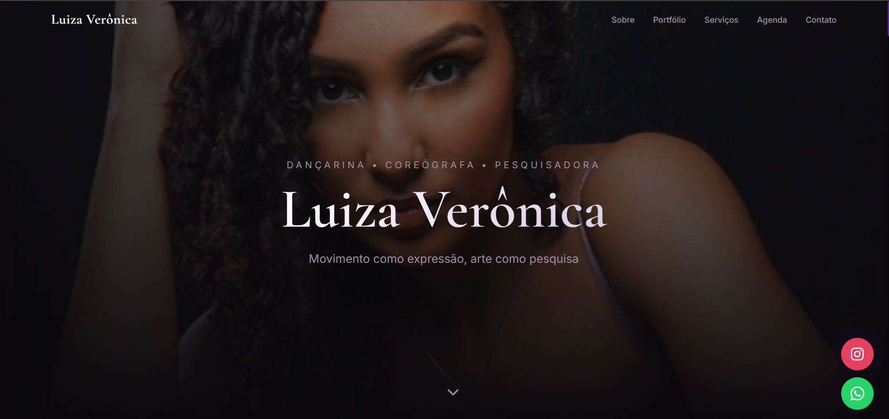

# Luiza Verônica — Movement Art

Site portfólio da artista **Luiza Verônica** — dançarina, coreógrafa e pesquisadora — com foco em estética contemporânea, experiência visual imersiva e navegação fluida.

---

## 🌐 Acesso

🔗 https://luizaveronica.com.br

---

## 🖼️ Preview



---

## ✨ Visão geral

O projeto apresenta:

* Hero com imagem de capa e identidade visual da artista
* Seção **Sobre** com biografia e formação acadêmica
* Portfólio com filtro por categorias (Destaques, Performance, Vídeo, Fotografia e Acadêmico)
* Lightbox para imagens e vídeos (YouTube)
* Seções de **Serviços, Agenda, Contato e Rodapé**
* Interface responsiva com foco em experiência mobile
* Animações suaves de entrada (fade/scroll reveal)

---

## 🛠️ Stack utilizada

* React 18
* TypeScript
* Vite 5
* Tailwind CSS
* shadcn/ui + Radix UI
* React Router DOM
* TanStack Query
* Vitest + Testing Library

---

## 📋 Requisitos

* Node.js 18+ (recomendado: LTS)
* npm (ou Bun, opcional)

---

## 🚀 Como executar localmente

1. Instale as dependências:

```bash
npm install
```

2. Inicie o servidor de desenvolvimento:

```bash
npm run dev
```

O projeto roda por padrão em:

```
http://localhost:8080
```

---

## 📦 Scripts disponíveis

### Desenvolvimento

```bash
npm run dev
```

### Build de produção

```bash
npm run build
```

### Preview do build

```bash
npm run preview
```

### Lint

```bash
npm run lint
```

### Testes

```bash
npm run test
```

### Testes em modo watch

```bash
npm run test:watch
```

---

## 🚀 Deploy

O projeto pode ser publicado via **GitHub Pages, Vercel ou Netlify**.

### Exemplo com GitHub Pages:

```bash
npm run build
npx gh-pages -d dist
```

---

## 📁 Estrutura do projeto

```
src/
  components/    # Componentes reutilizáveis
  pages/         # Páginas principais
  assets/        # Imagens e mídia
  hooks/         # Hooks customizados
  lib/           # Utilitários e helpers
  test/          # Testes
```

---

## 🔄 Fluxo de versionamento

```bash
git add .
git commit -m "Atualiza projeto"
git push
```

---

## 💡 Observações

* Projeto focado em performance e experiência visual
* Design minimalista e elegante
* Estrutura preparada para evolução contínua
* Otimizado para desktop e mobile

---

## 👤 Autoria

Desenvolvido para a artista **Luiza Verônica**

---
